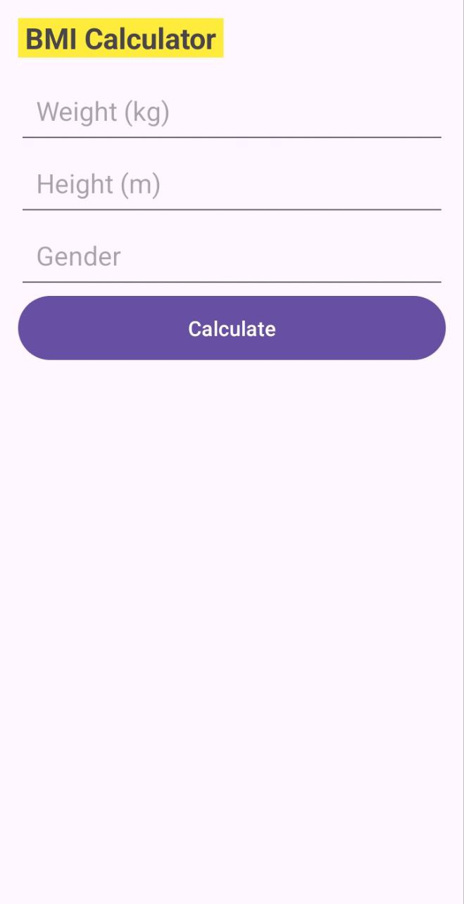
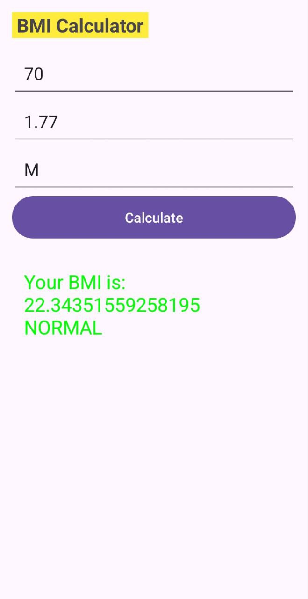
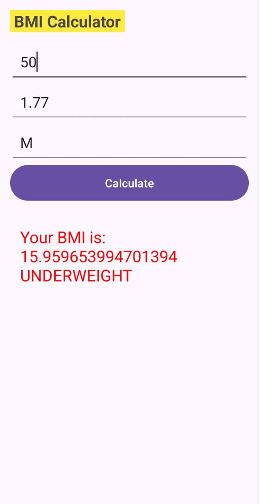

# Simple BMI Calculator


<p><strong>  ➡ Genaral Look</strong></p>


## Introduction
Welcome to the Simple BMI Calculator! This is a straightforward Android application developed in Kotlin to help users calculate their Body Mass Index (BMI). The app is designed to be user-friendly and efficient, providing quick and accurate results.

## Features
- Calculate BMI using height and weight
- Display BMI category (Underweight, Normal weight, Overweight, Obese)
- Clear input fields
- Simple and intuitive user interface

## Getting Started

### Prerequisites
To run this project, you need:
- Android Studio 4.0 or higher
- Android SDK 21 or higher

### Installation
1. Clone the repository:
    ```sh
    git clone https://github.com/yourusername/SimpleBMICalculator.git
    ```
2. Open the project in Android Studio.
3. Sync the project with Gradle files.
4. Run the app on an emulator or a physical device.

## Usage
1. Open the app.
2. Enter your height in centimeters and weight in kilograms.
3. Press the "Calculate" button to see your BMI.
4. The app will display your BMI and the corresponding category.

## Project Structure
- `MainActivity.kt`: Contains the main logic for calculating BMI and updating the UI.
- `activity_main.xml`: Defines the layout for the main activity, including input fields, buttons, and result display.
- `styles.xml` and `themes.xml`: Handle the app's appearance and theming.

## Screenshots
<div style="display: flex;">
     
    
    
</div>
<p><strong> 1️⃣ ➡ Healthy Demo------2️⃣ ➡ Overweight Demo----3️⃣ ➡ Underweight Demo </strong></p>


## Contributing
Contributions are welcome! If you find a bug or have a feature request, please open an issue or submit a pull request.

## Author
Nippon Chowdhury  
BSc in Computer Science  
[University of The People](https://www.uopeople.edu/)

## License
This project is licensed under the MIT License - see the [LICENSE](LICENSE) file for details.

## Acknowledgements
- [University of The People](https://www.uopeople.edu/) for the educational support.
- Android documentation and Kotlin community for providing helpful resources.

---

Thank you for checking out the Simple BMI Calculator! If you find this project helpful, please give it a star on GitHub.
